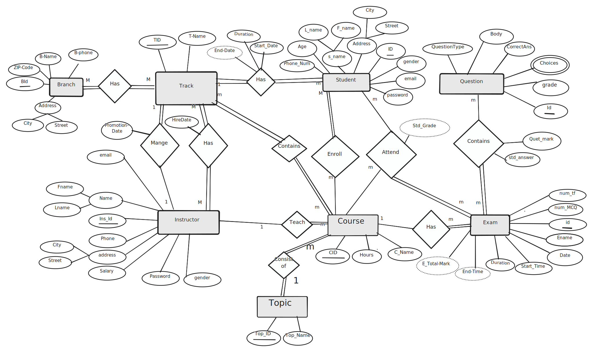
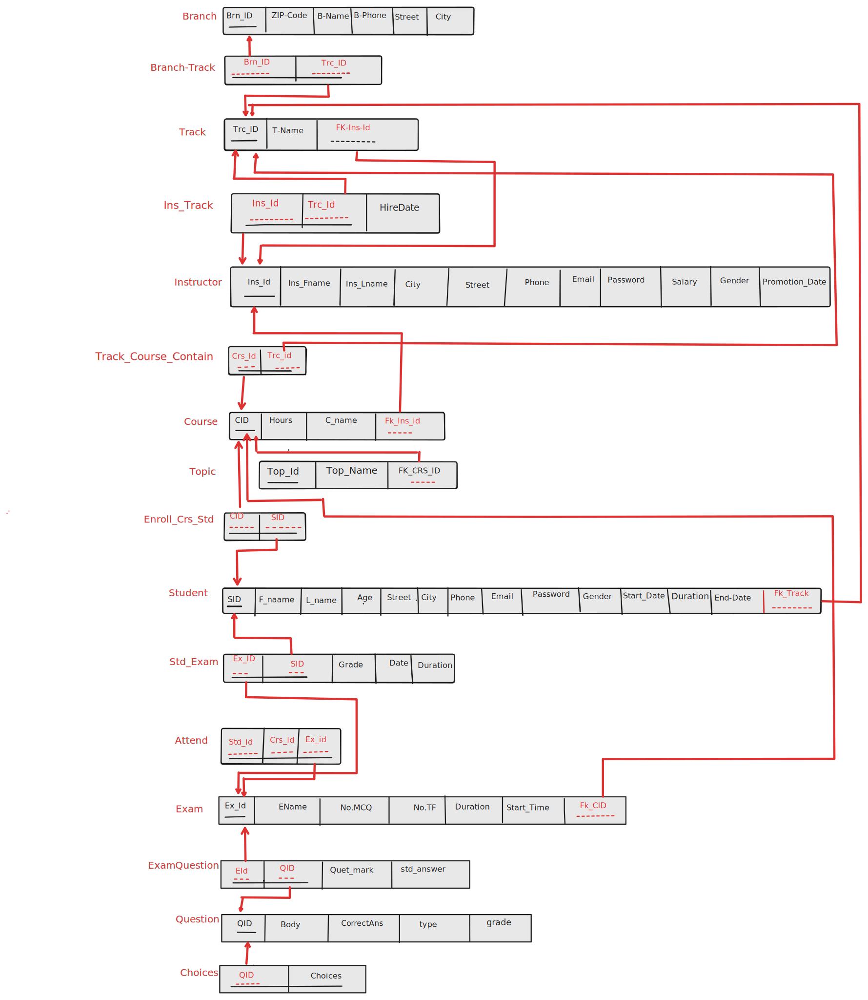

# Online Examination System 

## Overview
The Online Examination System is a database solution designed to manage and automate the administration of online exams. It facilitates various operations such as exam creation, student management, and report generation for ITI staff.
This project includes the following key components:
- **Entity-Relationship Diagram (ERD):** Illustrates the logical structure of the database.
- **Database Schema:** Defines the tables, relationships, and attributes.
- **Stored Procedures (SPs):** Implements core functionalities like CRUD operations, exam management, and report generation.

---
## Projects Description
[Projects Description](Files/Online_Examination_System.pdf)

## ERD Diagram

## Schema Diagram

## Reports

[Direct link to the reports](Reports/PDF/).

## Features

### Functional Requirements
1. **CRUD Operations:** 
   - Implemented for all tables to enable Create, Read, Update, and Delete functionalities.
   
2. **Exam Management SPs:**
   - **Exam Generation:** Automates the creation of exams with questions.
   - **Exam Answers:** Handles student answers during exams.
   - **Exam Correction:** Automates grading and calculates scores based on answers.

3. **Report Generation:**
   - Retrieve students' information filtered by Department Number.
   - Return grades of a student across all courses.
   - List courses taught by an instructor along with the number of enrolled students per course.
   - Display topics associated with a specific course.
   - Show all questions in a particular exam.
   - Retrieve questions and corresponding student answers for a specific exam and student.

---

## Database Design

### Entity-Relationship Diagram (ERD)
The ERD is structured to efficiently capture relationships among entities like Students, Courses, Exams, Instructors, and Tracks. Key features include:
- **Normalization:** Ensures minimal data redundancy.
- **Scalability:** Designed to handle a growing number of entities and relationships.

### Database Schema
- **Core Tables:**
  - `Student`
  - `Instructor`
  - `Course`
  - `Exam`
  - `Track`
  - `Branch`
  - `Topic`
  - `Question`
- **Relationship Tables:**
  - `Enroll`
  - `Teach`
  - `Attend`
  - `Contains`
  - `Consist_Of`
  - `Manage`

---

## Implementation Details

### Stored Procedures
1. **CRUD Procedures:**
   - Provided for all tables to ensure basic data manipulation capabilities.

2. **Exam-Specific Procedures:**
   - `sp_ExamGeneration`: Automates the process of adding exams with predefined parameters.
   - `sp_ExamAnswers`: Stores and validates student responses.
   - `sp_ExamCorrection`: Grades the exam and updates student grades.

3. **Report Procedures:**
   - `sp_GetStudentInfoByDept(dept_no)`: Fetches student information filtered by department.
   - `sp_GetStudentGrades(student_id)`: Retrieves all grades for a specific student.
   - `sp_GetInstructorCourses(ins_id)`: Lists courses taught by an instructor and student counts.
   - `sp_GetCourseTopics(course_id)`: Fetches all topics under a course.
   - `sp_GetExamQuestions(exam_id)`: Retrieves all questions in a specific exam.
   - `sp_GetExamAnswers(exam_id, student_id)`: Fetches questions and answers for a specific student and exam.

---

## Usage and Benefits

The database enables ITI staff to:
- **Efficiently Manage Exams:** Automates exam generation, grading, and results.
- **Streamline Reporting:** Provides actionable insights through dynamic reports.
- **Facilitate CRUD Operations:** Simplifies the management of entities like students, instructors, courses, and exams.

---

## Future Enhancements

- Integration with a front-end system for real-time exam administration.
- Advanced analytics and dashboard support for deeper insights.

